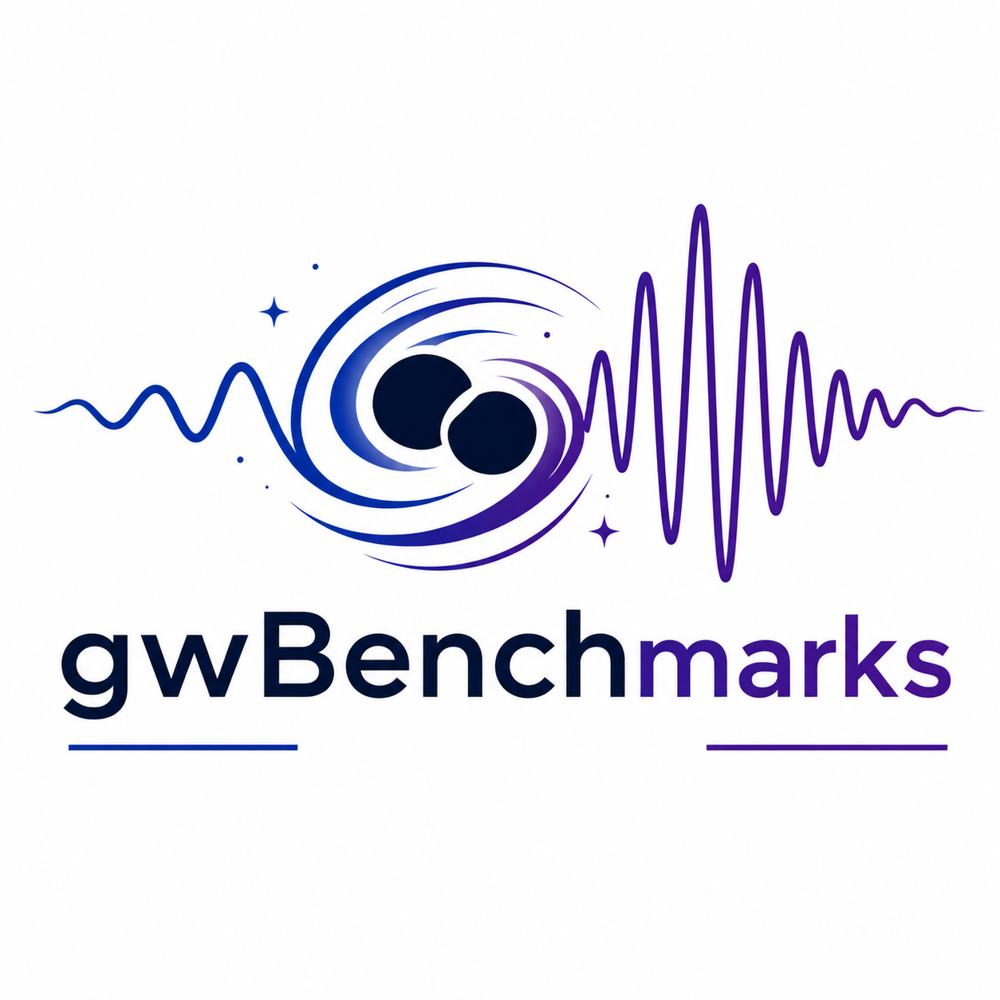

<p align="center">
  
</p>

<p align="center">
  <a href="https://tousifislam.com/gwBenchmarks/"></a>
  <a href="https://huggingface.co/GWagents"></a>
</p>

# gwBenchmarks

Benchmark suite for evaluating LLM-based gravitational wave (GW) modelling using fully numeric, physically motivated metrics. All tasks avoid human scoring and rely on standard loss functions from GW astronomy.

## Benchmarks

### 1. Waveform Bench (Co-precessing h₂₂)

| | |
|---|---|
| **Input** | q, spin vectors chi1, chi2, time grid t_i |
| **Output** | Re(h22(t_i)), Im(h22(t_i)) |
| **Loss** | Mean frequency-domain mismatch over total masses [40, 80, 120, 160, 200] M☉ |

### 2. Remnant Bench (Kick velocity)

| | |
|---|---|
| **Input** | q, spin vectors chi1, chi2 |
| **Output** | kick velocity magnitude v_k |
| **Loss** | NRMSE(v_k) |

### 3. Dynamics Bench (Eccentric spinning orbital dynamics)

| | |
|---|---|
| **Input** | q, chi1, chi2, initial conditions e0, x0, time grid t_i |
| **Output** | PN frequency parameter x(t_i) |
| **Loss** | Pointwise RMS relative error on x(t) |

### 4. Ringdown Bench (Quasi-normal modes)

| | |
|---|---|
| **Input** | final spin chi_f, mode indices (l, m, n) |
| **Output** | omega_real, omega_imag |
| **Loss** | Mean of relative errors on Re(ω) and Im(ω) |

### 5. Analytic Bench (Non-spinning BBH, q ∈ [1, 20])

| | |
|---|---|
| **Input** | q, time grid t_i |
| **Output** | Re(h22(t_i)), Im(h22(t_i)) |
| **Loss** | Mean frequency-domain mismatch over total masses [40, 80, 120, 160, 200] M☉ |

### 6. Validity Bench (NRHybSur3dq8 extrapolation)

| | |
|---|---|
| **Input** | q, chi1, chi2 |
| **Output** | predicted mismatch M̂ |
| **Loss** | RMSE(log M̂, log M*) |

### 7. Template Bank Bench (Frequency-domain template coverage)

| | |
|---|---|
| **Input** | public pool of `[m1, m2, s1z, s2z]` waveform parameters |
| **Output** | ordered bank rows `[m1, m2, s1z, s2z, phi_ref]` |
| **Loss** | Smallest bank prefix reaching 50% hidden-test coverage at match ≥ 0.97 |

### 8. New Physics Bench (RG-tail inspiral)

| | |
|---|---|
| **Input** | Physics formulas from arXiv:2602.08833 (source packet) |
| **Output** | `h_of_f(f, Mc, eta, dL, lambda_RG, ...)` implementation |
| **Loss** | Mean frequency-domain mismatch over 144 test cases (4 Mc × 4 eta × 3 dL × 3 lambda_RG) |

This benchmark is **formula-driven**: the agent receives post-Newtonian formulas for the dominant (2,2) mode with RG-tail corrections and must implement a frequency-domain waveform from first principles. The beyond-GR parameter `lambda_RG` deforms the radiative tail propagation; `lambda_RG = 1` recovers GR.

## Frequency-domain mismatch

The FD mismatch is computed via PyCBC using the aLIGO `aLIGOZeroDetHighPower` PSD, maximized over time and phase shifts:

```
mismatch = 1 - max_{t,phi} <h_pred, h_ref> / sqrt(<h_pred, h_pred> <h_ref, h_ref>)
```

with `f_low = 15 Hz`, `f_high = 990 Hz`. PyCBC is required for the waveform, analytic, template bank, and new physics benchmarks.

## Datasets

Binary dataset files are **not** stored in this repository due to size. They are hosted on Hugging Face:

**[🤗 GWagents/gwBenchmarks](https://huggingface.co/datasets/GWagents/gwBenchmarks)**

Each benchmark directory under `datasets/` contains:
- `README.md` — dataset description, parameter ranges, train/val split
- `scripts/` — curation and plotting scripts
- `plots/` — reference plots of the dataset

| Benchmark | Training | Validation |
|---|---|---|
| waveform | `waveform_training.h5` | `waveform_validation.h5` |
| remnant | `remnant_training.h5` | `remnant_validation.h5` |
| dynamics | `dynamics_training.h5` | `dynamics_validation.h5` |
| ringdown | `ringdown_training.h5` | `ringdown_validation.h5` |
| analytic | `analytic_training.h5` | `analytic_validation.h5` |
| validity | `validity_training.h5` | `validity_validation.h5` |
| template_bank | `bank_wf_params.npy` (+ grid/weights) | `bank_wf_params_test.npy` |
| new_physics | — (formula-driven) | Reference in `gwbenchmarks/rg_tail_reference.py` |

## Rules

- No brute-force optimization at evaluation time — all outputs must be direct model predictions.
- Metrics are fully numeric and reproducible.

## Installation

```bash
pip install -e .
```

## Usage

```python
from gwbenchmarks import WaveformBench

bench = WaveformBench(config_path="configs/waveform.yaml")
result = bench.evaluate(predictions, targets, runtime=0.005)
print(f"Loss: {result.loss:.6f}")
```

## Project Structure

```
gwBenchmarks/
├── gwbenchmarks/
│   ├── __init__.py
│   ├── metrics.py              # FD mismatch, RMS relative error, NRMSE
│   ├── runner.py               # Benchmark runner
│   ├── rg_tail_reference.py    # Reference waveform for New Physics Bench
│   └── benchmarks/
│       ├── base.py             # Abstract benchmark class
│       ├── waveform.py
│       ├── remnant.py
│       ├── dynamics.py
│       ├── ringdown.py
│       ├── analytic.py
│       ├── validity.py
│       ├── template_bank.py
│       └── new_physics.py
├── configs/                    # YAML configs per benchmark
└── datasets/                   # READMEs, scripts, plots (binary data hosted on Hugging Face)
```
